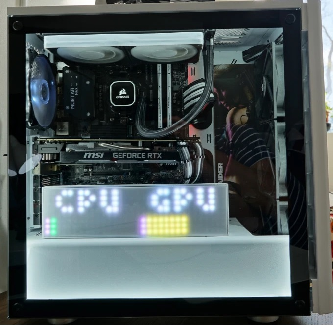

# RGB LED Matrix Driver
NOTE: This project specifically targets Windows platform with Windows-specific code. But it is possible to adapt it to any platform with some work.

This project aims to create a host and controller programs to drive an LED matrix using a PC in real time. The LED type used in the matrix was WS2812b.

For more detailed description of this project, please visit this [blog](https://sanje2v.wordpress.com/2020/09/21/microbit-controlled-led-matrix-for-cpu-gpu-usage-display-and-audio-output-visualization/).

# Introduction

Before doing anything else:
- Disable Bluetooth related system code for micro:bit to free memory for frame buffer by setting 'Softdevice' under 'Tools' menu of your Arduino IDE to 'None'.
- Redefine stack and heap default memory allocation specified by _'gcc_startup_nrf51.S'_ under _'%USERPROFILE%\AppData\Local\Arduino15\packages\sandeepmistry\hardware\nRF5\0.6.0\cores\nRF5\SDK\components\toolchain\gcc'_. The 'Stack_Size' should be set to 224 and 'Heap_Size' to 32. A sample modified _'gcc_startup_nrf51.S'_ can be found under _'tests/gcc_startup_nrf51.S_modified_sample'_.

## For micro:bit

The files under 'controller' folder are to be programmed into micro:bit using Arduino IDE.

## For host PC

- Install python dependencies specified in _requirements.txt_.
- The function plugin 'CPU and GPU usage monitor' assumes you have a NVIDIA GPU and uses the nvml python library to query GPU usage information. The library requires that ‘nvml.dll’ be located at _‘%PROGRAMFILES%\NVIDIA Corporation\NVSMI’_ but this DLL may be installed in ‘System32’ directory by NVIDIA’s driver installer. So, instead of copying this DLL, creating a symbolic link is advisable using ‘mklink’ command.
- Compile the project 'ElevatedInformationProviderService and register the built service to run 'Manual' using 'installutil.exe &lt;Path to compiled service exe&gt;'. This service is required to query CPU core temperature with admin privileges.
- Make note of the COM port assigned to micro:bit by Windows.
- The program will run in GUI mode with 'python main.py'.
- To run in daemon mode pass arguments as follows: _–as-daemon ‘<COM port>’ ‘<Full name of function defined by name() for each function module’_. For example: _‘python main.py –as-daemon ‘COM5’ ‘CPU and GPU usage monitor’_.
- Similarly, to cleanly terminate a background daemon process pass _–kill-daemon_ command line parameter.
- Windows  _‘USB selective suspend’_. feature might interfere with Serial over USB function by breaking TX line after an unpredictable period. It can be disabled in _‘Device manager’_.

## For LED matrix housing case
If you would like to print a 3D housing case for the LED matrix, a model file is available at _'3DModels\DesktopCaseLEDMatrixHousing.3mf'_.

# License
Open Hardware Monitor Library DLL is the property of Michael Moller.

> This software can be used and redistributed royalty-free as well as used derivatively in another non-commercial work without permission from original author. The original author claims no liability of damage and provides no guarantee in providing this software. Any commercial usage of any part of this work without explicit permission from the original author is prohibited.